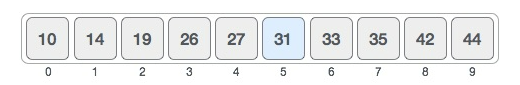
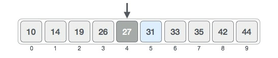
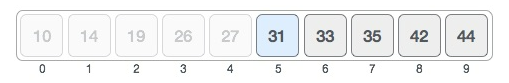
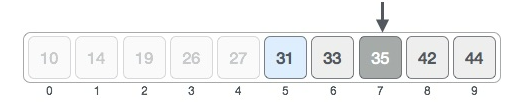
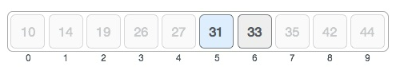
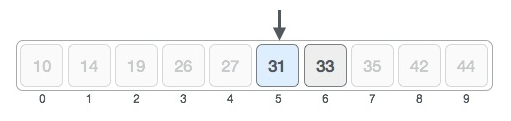

import Tabs from '@theme/Tabs';
import TabItem from '@theme/TabItem';

# Binary Search 

Binary search is a search algorithm that works on the basis of divide and conquer. The algorithm works on the basis of identifying the middle item in a list and using that to divide the list into two. The process continues until the required value is located. 

Condition in the binary search:

- The list being searched is already sorted.
- If the list is not sorted, it should be first sorted using a sorting algorithm before searching.

A binary search has a time complexity of O(log n)- Logarithmic time. This means that the list is divided in half every time. Here’s how it works:

## Functonality of Binary Search

Binary search begins with a sorted list. From the sorted list, subarrays are created. This begins with the middle value of the list being identfied. The value being searched for is then compared with the middle value. If it is larger than the middle value, the upper half of the list is selected for further analysis. If not, the lower half is selected. This is as illustrated below:

Assumptions:

- We have a sorted list of a few values between 0 and 50.
- We are looking for the location of 31 in the list.



The position of the mid value is located using the indices of the values where 0 is the lowest index and 9 is the highest. The formula to find the mid is:

mid index = lowest index + (highest index - lowest index)/2             With the answer rounded down.

In our case, this yeilds: 

mid index = 0 + (9 - 0)/2 = 4.5

Hence, when rounded down, mid index = 4.



The value at the mid index (27), is lower than the value being searched for (31). Therefore, we use the upper half of the list to search for the index of the value.



Our lowest index *in the subarray then becomes mid index + 1 = 5, and the highest index remains 9.
We then find the mid index of that new subarray with the same formula which yields:

mid index = 5 + (9 - 5)/2 = 7

We then find the value at index 7.



The value at the mid index (35) is higher than the value being searched for (31). Hence, we use the lower half of the list to search for the index of the value. 
The highest index in the subarray then becomes the mid index - 1 = 6, and the lowest index remains 5.



The mid index hence, becomes:

mid index = 5 + (6 - 5)/2 = 5.5

Hence, when rounded down, mid index = 5.



Comparing the value at index 5 (31) with the value being searched for (31) reveals that that is the value being searched for. Hence, the answer we get is index 5 as the location of the value 31.


## Recursive Binary Search

Binary search, as we have seen, involves a lot of iteration in order to divide the lists into halves and check them . Therefore, a suitable alternative would be the recursive binary search whereby the function uses recursive method calls instead of iterating all through. This is as shown in the code examples.   


## Advantages of Binary Search

- Narrows down the search by eliminating half the list after comparison.
- It states whether the item being searched for is before or after the mid position.
- Suitable for large lists.

## Disadvantages of Binary Search

- Only works on sorted lists.
- It is an overkill for small data sets.
- It is more complicated than linear search.

## Applications of Binary Search

- Binary search is used to implement features like autocomplete.
- Finding prefixes.

## Implementation of binary search

Code examples of finding an item using binary search are as follows:

### 1. Binary search for an item in a list

To select a specific item from a list, the code is as follows:

<Tabs
    defaultValue="py"
    values={[
        { label: 'Python', value: 'py', },
        { label: 'Java', value: 'java', }
    ]
}>
<TabItem value="py">

```py
def binary_search(arr, target):
    start = 0
    end = len(arr) -1
    while start <= end:
        #find the mid element
        #int mid = (start + end) / 2; might be possible that (start + end) exceeds the range.
        mid = start + (end-start)//2
        if arr[mid] > target:
            #check in the left side of the array
            end = mid - 1
        elif arr[mid]<target:
            #check in the right side of the array
            #move the new start to be mid + 1
            start = mid + 1
        else:
            return mid


```

</TabItem>
<TabItem value="java">

```java
package com.sly;

public class BinarySearch {

    public static void main(String[] args) {
        int[] arr = {-15, -10, -5, 0, 5, 6, 7, 8, 9, 10, 22, 78, 90, 100, 106};
        int target = 22;
        int ans = binarySearch(arr, target);
        System.out.println(ans);
    }

    // return the index
    // return -1 if it does not exist
    static int binarySearch(int[] arr, int target) {
        int start = 0;
        int end = arr.length - 1;

        while(start <= end) {
            // find the middle element
//            int mid = (start + end) / 2; // might be possible that (start + end) exceeds the range of int in java
            int mid = start + (end - start) / 2;

            if (target < arr[mid]) {
                end = mid - 1;
            } else if (target > arr[mid]) {
                start = mid + 1;
            } else {
                // ans found
                return mid;
            }
        }
        return -1;
    }
}

```

</TabItem>

</Tabs>

### 2. Recursive binary search

Using the recursive binary search methos is as illustrated:

<Tabs
    defaultValue="py"
    values={[
        { label: 'Python', value: 'py', },
        { label: 'Java', value: 'java', },
    ]
}>
<TabItem value="py">

```py
def recurssive_binary_search(arr, target, start, end):
    if start>end:
        return -1

    mid = start + (end - start)//2

    if arr[mid] == target:
        return mid

    if arr[start] <= target:
        if arr[target] >= arr[start] and arr[target] <= arr[mid]:
            return recurssive_binary_search(arr, target, start, mid-1)
        else:
            return recurssive_binary_search(arr, target, mid + 1, end)


    if arr[target] >= arr[mid] and arr[target] <= arr[end]:
        return recurssive_binary_search(arr, target, mid+1, end)
    return recurssive_binary_search(arr, target, start, mid-1)
    
if __name__ == '__main__':
    arr = [0, 1, 2, 3, 4, 5, 6, 7, 8, 9, 10, 38, 90, 101, 3003, 10000]
    target = 13
    print(recurssive_binary_search(arr, target, 0, len(arr) -1))


```

</TabItem>
<TabItem value="java">

```java
package com.sly;

public class Recursive_BS {
    public static void main(String[] args) {
        int[] arr = {5, 6, 7, 8, 9, 1, 2, 3};
        System.out.println(search(arr, 4, 0, arr.length - 1));
    }

    static int search(int[] arr, int target, int start, int end) {
        if (start > end) {
            return -1;
        }

        int mid = start + (end-start) / 2;
        if (arr[mid] == target) {
            return mid;
        }

        if (arr[start] <= arr[mid]) {
            if (target >= arr[start] && target <= arr[mid]) {
                return search(arr, target, start, mid-1);
            } else {
                return search(arr, target, mid+1, end);
            }
        }

        if (target >= arr[mid] && target <= arr[end]) {
            return search(arr, target, mid+1, end);
        }

        return search(arr, target, start, mid-1);
    }

}
```
</TabItem>
</Tabs>


## What's next?

- Check out the leet code [challenge](https://leetcode.com/problems/binary-search/).
- Check out the leet code [content on binary search](https://leetcode.com/explore/learn/card/binary-search/).
- Check out this python [tutorial](https://realpython.com/binary-search-python/)
- Check out this java [tutorial](https://www.javatpoint.com/binary-search-in-java)
- Find inspirations from [Wikipedia](https://en.wikipedia.org/wiki/Binary_search_algorithm)
- Get involved in the [JKUAT SES Community](https://github.com/JKUATSES/dataStructuresAlgorithms/)

Anything **unclear** or **buggy** in this tutorial? [Please report it!](https://github.com/JKUATSES/dataStructuresAlgorithms/issues)
