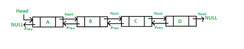

import Tabs from '@theme/Tabs';
import TabItem from '@theme/TabItem';

# Linked List ⛓️

A linked list is a dynamic data structure, which means that the size of the list can change at run time. You can imagine a linked list as a chain where each link is connected to the next one to form a sequence with a start and an end.

Each element of a linked list is called a node, and every node has two different fields:

- Data contains the value to be stored in the node.
- Next contains a reference to the next node on the list.

A linked list is a collection of nodes. The first node is called the head, and it’s used as the starting point for any iteration through the list. The last node must have its next reference pointing to None to determine the end of the list. Here’s how it looks:

## Types of Linked List

Linked lists can be classiffied under:

1. Simple Linked List − Item navigation is forward only.
2. Doubly Linked List − Items can be navigated forward and backward.
3. Circular Linked List − Last item contains link of the first element as next and the first element has a link to the last element as previous.

## Single Linked List

Singly linked lists contain nodes which have a data part as well as an address part i.e. next, which points to the next node in the sequence of nodes.


### Basic operations

When we want to operate data in linked list we carry out the following operations:

1. Insertion − Adds an element at the beginning of the list.
2. Deletion − Deletes an element at the beginning of the list.
3. Display − Displays the complete list.
4. Search − Searches an element using the given key.
5. Delete − Deletes an element using the given key.

## Double linked list

Doubly Linked List is a variation of Linked list in which navigation is possible in both ways, either forward and backward easily as compared to Single Linked List. Following are the important terms to understand the concept of doubly linked list.

- Link − Each link of a linked list can store a data called an element.
- Next − Each link of a linked list contains a link to the next link called Next.
- Prev − Each link of a linked list contains a link to the previous link called Prev.

LinkedList − A Linked List contains the connection link to the first link called First and to the last link called Last.



### Basic Operations

Following are the basic operations supported by a list.

1. Insertion − Adds an element at the beginning of the list.
2. Deletion − Deletes an element at the beginning of the list.
3. Insert Last − Adds an element at the end of the list.
4. Delete Last − Deletes an element from the end of the list.
5. Insert After − Adds an element after an item of the list.
6. Delete − Deletes an element from the list using the key.
7. Display forward − Displays the complete list in a forward manner.
8. Display backward − Displays the complete list in a backward manner.

## Advantages of Linked Lists

- They are a dynamic in nature which allocates the memory when required.
- Insertion and deletion operations can be easily implemented.
- Stacks and queues can be easily executed.
- Linked List reduces the access time.

## Disadvantages of Linked Lists

- The memory is wasted as pointers require extra memory for storage.
- No element can be accessed randomly; it has to access each node sequentially.
- Reverse Traversing is difficult in linked list.

## Applications of Linked Lists

- Linked lists are used to implement stacks, queues, graphs, etc.
- Linked lists let you insert elements at the beginning and end of the list.
- In Linked Lists we don't need to know the size in advance.

## Implementation of a linked list

Common singly linked​ list operations

### 1. Search for a node in the ist

You can determine and retrieve a specific node from the front, end, or anywhere in the list.

The worst-case​ Time Complexity for retrieving a node from anywhere in the list is O(n).

<Tabs
    defaultValue="cpp"
    values={[
        { label: 'Cpp', value: 'cpp', },
        { label: 'Python', value: 'py', },
        { label: 'Matlab', value: 'matlab', },
    ]
}>
<TabItem value="cpp">

```cpp
bool search(int val)
{
    Node* temp = head;
    while(temp != NULL)
    {
    if (temp->data == val)
        return true;
    temp = temp->next;
    }
    return false;
}

```

</TabItem>
<TabItem value="py">

```py
def search(self, data):
    print("Searching: {}".format(data))
    current_head = self.head
    found = False
    while current_head and found is False:
        if current_head.get_data() == data:
            found = True
            print("Found: {}".format(data))
        else:
            current_head = current_head.get_next()
    if current_head is None:
        raise ValueError("Data not in list")
    return current_head

```

</TabItem>
<TabItem value="matlab">

```matlab
1 + 1
```

</TabItem>
</Tabs>

### 2. Add a node to the list

You can add a node at the front, end, or anywhere in the linked list.

The worst-case Time Complexities for performing these operations are:

Add an item to the front of the list: O(1)
Add an item to the end of the list: O(n)
Add an item a​nywhere in the list: O(n)

<Tabs
    defaultValue="cpp"
    values={[
        { label: 'Cpp', value: 'cpp', },
        { label: 'Python', value: 'py', },
        { label: 'Matlab', value: 'matlab', },
    ]
}>
<TabItem value="cpp">

```cpp
void insert(int val)
{
    // make a new node
    Node* new_node = new Node;
    new_node->data = val;
    new_node->next = NULL;

    // If list is empty, make the new node, the head
    if (head == NULL)
    head = new_node;
    // else, make the new_node the head and its next, the previous
    // head
    else
    {
    new_node->next = head;
    head = new_node;
    }
}

```

</TabItem>
<TabItem value="py">

```py
def insert(self, data):
    new_node = Node(data)
    new_node.set_next(self.head)
    self.head = new_node
```

</TabItem>
<TabItem value="matlab">

```matlab
1 + 1
```

</TabItem>
</Tabs>

### 3. Remove a node from the list

You can remove a node from the front, end, or anywhere in the list.

The worst-case Time Complexities for performing this operation are:

Remove an item from the front of the list: O(1)
Remove an item from the end of the list: O(n)
Remove an item from anywhere in the list: O(n)

<Tabs
    defaultValue="cpp"
    values={[
        { label: 'Cpp', value: 'cpp', },
        { label: 'Python', value: 'py', },
        { label: 'Matlab', value: 'matlab', },
    ]
}>
<TabItem value="cpp">

```cpp
void remove(int val)
{
    // If the head is to be deleted
    if (head->data == val)
    {
    delete head;
    head = head->next;
    return;
    }

    // If there is only one element in the list
    if (head->next == NULL)
    {
    // If the head is to be deleted. Assign null to the head
    if (head->data == val)
    {
        delete head;
        head = NULL;
        return;
    }
    // else print, value not found
    cout << "Value not found!" << endl;
    return;
    }

    // Else loop over the list and search for the node to delete
    Node* temp = head;
    while(temp->next!= NULL)
    {
    // When node is found, delete the node and modify the pointers
    if (temp->next->data == val)
    {
        Node* temp_ptr = temp->next->next;
        delete temp->next;
        temp->next = temp_ptr;
        return;
    }
    temp = temp->next;
    }

    // Else, the value was neve in the list
    cout << "Value not found" << endl;
}

```

</TabItem>
<TabItem value="py">

```py
def delete(self, data):
    print("Deleting: {}".format(data))
    current_head = self.head
    previous_head = None
    found = False
    while current_head and found is False:
        if current_head.get_data() == data:
            found = True

        else:
            previous_head = current_head
            current_head = current_head.get_next()
    if current_head is None:
        raise ValueError("Data not in list")
    if previous_head is None:
        self.head = current_head.get_next()
    else:
        previous_head.set_next(current_head.get_next())
```

</TabItem>
<TabItem value="matlab">

```matlab
1 + 1
```

</TabItem>
</Tabs>

### Combined code

<Tabs
    defaultValue="cpp"
    values={[
        { label: 'Cpp', value: 'cpp', },
        { label: 'Python', value: 'py', },
        { label: 'Matlab', value: 'matlab', },
    ]
}>
<TabItem value="cpp">

```cpp
#include <iostream>
using namespace std;

// Making a node struct containing a data int and a pointer
// to another node
struct Node {
  int data;
  Node *next;
};

class LinkedList
{
    // Head pointer
    Node* head;

  public:
    // default constructor. Initializing head pointer
    LinkedList()
    {
      head = NULL;
    }

    // inserting elements (At start of the list)
    void insert(int val)
    {
      // make a new node
      Node* new_node = new Node;
      new_node->data = val;
      new_node->next = NULL;

      // If list is empty, make the new node, the head
      if (head == NULL)
        head = new_node;
      // else, make the new_node the head and its next, the previous
      // head
      else
      {
        new_node->next = head;
        head = new_node;
      }
    }

    // loop over the list. return true if element found
    bool search(int val)
    {
      Node* temp = head;
      while(temp != NULL)
      {
        if (temp->data == val)
          return true;
        temp = temp->next;
      }
      return false;
    }


    void remove(int val)
    {
      // If the head is to be deleted
      if (head->data == val)
      {
        delete head;
        head = head->next;
        return;
      }

      // If there is only one element in the list
      if (head->next == NULL)
      {
        // If the head is to be deleted. Assign null to the head
        if (head->data == val)
        {
          delete head;
          head = NULL;
          return;
        }
        // else print, value not found
        cout << "Value not found!" << endl;
        return;
      }

      // Else loop over the list and search for the node to delete
      Node* temp = head;
      while(temp->next!= NULL)
      {
        // When node is found, delete the node and modify the pointers
        if (temp->next->data == val)
        {
          Node* temp_ptr = temp->next->next;
          delete temp->next;
          temp->next = temp_ptr;
          return;
        }
        temp = temp->next;
      }

      // Else, the value was neve in the list
      cout << "Value not found" << endl;
    }

    void display()
    {
      Node* temp = head;
      while(temp != NULL)
      {
        cout << temp->data << " ";
        temp = temp->next;
      }
      cout << endl;
    }
};

int main() {

  LinkedList l;
  // inserting elements
  l.insert(6);
  l.insert(9);
  l.insert(1);
  l.insert(3);
  l.insert(7);
  cout << "Current Linked List: ";
  l.display();

  cout << "Deleting 1: ";
  l.remove(1);
  l.display();

  cout << "Deleting 13: ";
  l.remove(13);

  cout << "Searching for 7: ";
  cout << l.search(7) << endl;

  cout << "Searching for 13: ";
  cout << l.search(13) << endl;
}

```

</TabItem>
<TabItem value="py">

```py
class Node:
    def __init__(self, data=None, next_node=None):
        self.data = data
        self.next_node = next_node

    def __repr__(self):
        return self.data

    def get_data(self):
        return self.data

    def get_next(self):
        return self.next_node

    def set_data(self, data=None):
        self.data = data

    def set_next(self, next_node=None):
        self.next_node = next_node


class LinkedList:
    def __init__(self):
        self.head = None

    def insert(self, data):
        new_node = Node(data)
        new_node.set_next(self.head)
        self.head = new_node

    def size(self):
        current_head = self.head
        count = 0
        while current_head:
            current_head = current_head.get_next()
            count += 1
        return count

    def search(self, data):
        print("Searching: {}".format(data))
        current_head = self.head
        found = False
        while current_head and found is False:
            if current_head.get_data() == data:
                found = True
                print("Found: {}".format(data))
            else:
                current_head = current_head.get_next()
        if current_head is None:
            raise ValueError("Data not in list")
        return current_head

    def delete(self, data):
        print("Deleting: {}".format(data))
        current_head = self.head
        previous_head = None
        found = False
        while current_head and found is False:
            if current_head.get_data() == data:
                found = True

            else:
                previous_head = current_head
                current_head = current_head.get_next()
        if current_head is None:
            raise ValueError("Data not in list")
        if previous_head is None:
            self.head = current_head.get_next()
        else:
            previous_head.set_next(current_head.get_next())

    def printLL(self):
        current = self.head
        data = "Current List: "
        while current:
            data += str(current.data) + " "
            current = current.get_next()
        print(data)

if __name__ == '__main__':
    LL = LinkedList()
    LL.insert(3)
    LL.insert(6)
    LL.insert(4)
    LL.insert(12)
    LL.insert(19)
    LL.printLL()
    LL.delete(4)
    LL.printLL()
    LL.delete(12)
    LL.printLL()
    LL.search(6)
    LL.search(12)
```

</TabItem>
<TabItem value="matlab">

```matlab
1 + 1
```

</TabItem>
</Tabs>

### Compilation

<Tabs
    defaultValue="cpp"
    values={[
        { label: 'Cpp', value: 'cpp', },
        { label: 'Python', value: 'py', },
        { label: 'Matlab', value: 'matlab', },
    ]
}>
<TabItem value="cpp">


</TabItem>
<TabItem value="py">


</TabItem>
<TabItem value="matlab">

</TabItem>
</Tabs>

## What's next?

- Check out the leet code [challenge 1](https://leetcode.com/problems/linked-list-components/).
- Check out the leet code [challenge 2](https://leetcode.com/problems/design-browser-history/).
- Check out this python [tutorial](https://realpython.com/linked-lists-python/)
- Check out this cpp [tutorial](https://data-flair.training/blogs/linked-list-in-c-cpp/)
- Check out this matlab [tutorial](https://uk.mathworks.com/help/matlab/matlab_oop/example-implementing-linked-lists.html)
- Find inspirations from [Wikipedia](https://en.wikipedia.org/wiki/Linked_list)
- Get involved in the [JKUAT SES Community](https://github.com/JKUATSES/dataStructuresAlgorithms/)

Anything **unclear** or **buggy** in this tutorial? [Please report it!](https://github.com/JKUATSES/dataStructuresAlgorithms/issues)
