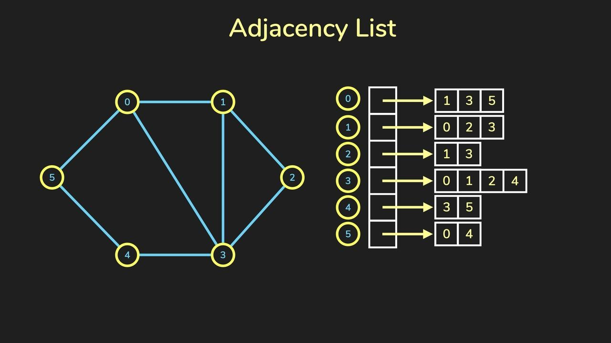
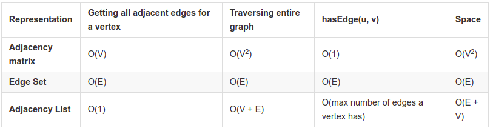
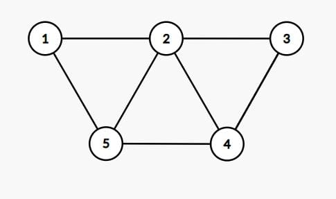
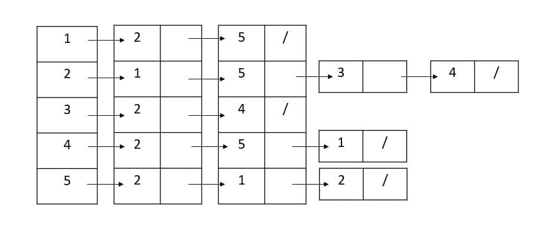
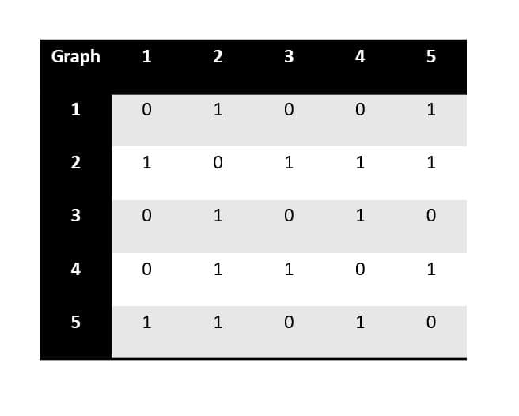
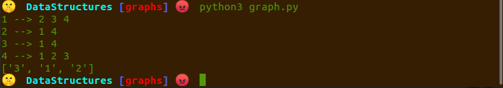
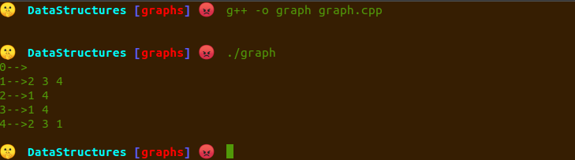
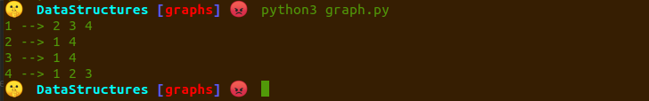

import Tabs from '@theme/Tabs';
import TabItem from '@theme/TabItem';

# Graph 🕸️

A graph is a pictorial representation of a set of objects where some pairs of objects are connected by links. The interconnected objects are represented by points termed as vertices, and the links that connect the vertices are called edges.

Formally, a graph is a pair of sets (V, E), where V is the set of vertices and E is the set of edges, connecting the pairs of vertices.

Here is a pictorial representation of how it looks like.


__credit https://www.geeksforgeeks.org/graph-data-structure-and-algorithms/__

Mathematical graphs can be represented in data structure. We can represent a graph using an array of vertices and a two-dimensional array of edges. Before we proceed further, let's familiarize ourselves with some important terms −

- **Vertex** − Each node of the graph is represented as a vertex. In the following example, the labeled circle represents vertices. Thus, A to G are vertices. We can represent them using an array as shown in the following image. Here A can be identified by index 0. B can be identified using index 1 and so on.

- **Edge** − Edge represents a path between two vertices or a line between two vertices. In the following example, the lines from A to B, B to C, and so on represents edges. We can use a two-dimensional array to represent an array as shown in the following image. Here AB can be represented as 1 at row 0, column 1, BC as 1 at row 1, column 2 and so on, keeping other combinations as 0.

- **Adjacency** − Two node or vertices are adjacent if they are connected to each other through an edge. In the following example, B is adjacent to A, C is adjacent to B, and so on.

- **Path** − Path represents a sequence of edges between the two vertices. In the following example, ABCD represents a path from A to D.

- A **pair** (x,y) is referred to as an edge, which communicates that the x vertex connects to the y vertex.
## Types of Graphs

Graphs can be classiffied into:

1. **Undirected Graph**: In an undirected graph, nodes are connected by edges that are all bidirectional. For example if an edge connects node 1 and 2, we can traverse from node 1 to node 2, and from node 2 to 1.


__credit https://mathinsight.org/definition/undirected_graph__

1. **Directed Graph**: In a directed graph, nodes are connected by directed edges – they only go in one direction. For example, if an edge connects node 1 and 2, but the arrow head points towards 2, we can only traverse from node 1 to node 2 – not in the opposite direction.


__credit https://mathinsight.org/definition/directed_graph__
## Types of Graph Representations

1. **Adjacency List**

To create an Adjacency list, an array of lists is used. The size of the array is equal to the number of nodes.

A single index, array[i] represents the list of nodes adjacent to the ith node.



__credit https://www.jomaclass.com/blog/graph-representation-edge-list-adjacency-matrix-and-adjacency-lists__

1. **Adjacency Matrix**

An Adjacency Matrix is a 2D array of size V x V where V is the number of nodes in a graph. A slot matrix[i][j] = 1 indicates that there is an edge from node i to node j.


__credit https://guides.codepath.com/compsci/Graphs__
### Basic operations

Following are basic primary operations of a Graph −

1. Adding a Vertex
2. Deleting a Vertex
3. Adding an edge
4. Deleting an edge
5. Display graph
6. Checking if there is an edge between node A and B
7. Finding the successors of a given vertex
8.  Finding a path between two vertices

## Advantages

**Adjacency list**
1. Easy to find successors of a node
2. Easy to find all neighbouring nodes
3. Space efficient as it only stores connected nodes

**Adjacency matrix**
1. Easy to add or remove an edge
2. Easy to check if an edge existing

## Disadvantages

**Adjacency matrix**
1. The larger the graph (more nodes), the more memory is needed.
2. For a sparse graph, space will be wasted for not storing many edges.
3. If static array is used for the matrix, adding or deleting nodes may not be easy.

**Adjacency list**
1. It is time consuming to check if an edge is part of a graph

## Applications of Linked Lists

- In **Computer science** graphs are used to represent the flow of computation.
- **Google maps** uses graphs for building transportation systems, where intersection of two(or more) roads are considered to be a vertex and the road connecting two vertices is considered to be an edge, thus their navigation system is based on the algorithm to calculate the shortest path between two vertices.
- In **Facebook**, users are considered to be the vertices and if they are friends then there is an edge running between them. Facebook’s Friend suggestion algorithm uses graph theory. Facebook is an example of undirected graph.
- In **World Wide Web**, web pages are considered to be the vertices. There is an edge from a page u to other page v if there is a link of page v on page u. This is an example of Directed graph. It was the basic idea behind Google Page Ranking Algorithm.
- In **Operating System**, we come across the Resource Allocation Graph where each process and resources are considered to be vertices. Edges are drawn from resources to the allocated process, or from requesting process to the requested resource. If this leads to any formation of a cycle then a deadlock will occur.

## Runtime Analysis

Below is a chart of the most common graph operations and their runtimes for each of the graph representations. In the chart below, V represents the number of verticies in the graph and E represents the number of edges in the graph.



__credit: https://guides.codepath.com/compsci/Graphs__

## Implementation of a graph using 

G is an undirected graph with 5 vertices and 7 edges.



Adjacency-list representation of G.



The adjacency-matrix representation of G.




## code

<Tabs
    defaultValue="cpp"
    values={[
        { label: 'Cpp', value: 'cpp', },
        { label: 'Python', value: 'py', },
        { label: 'Matlab', value: 'matlab', },
    ]
}>
<TabItem value="cpp">

```cpp
#include <iostream>
#include<list>
using namespace std;

class graph{
public:
    list<int> *adjlist;
    int n;
    graph(int v){
        adjlist=new list<int> [v];
        n=v;
    }

    void addedge(int u,int v,bool bi){
        adjlist[u].push_back(v);
        if(bi){
            adjlist[v].push_back(u);
        }
    }

    void print(){
        for(int i=0;i<n;i++){
            cout<<i<<"-->";
            for(auto it:adjlist[i]){
                cout<<it<<" ";
            }
            cout<<endl;
        }
        cout<<endl;
    }


};

int main() {
    graph g(5);
    g.addedge(1,2,true);
    g.addedge(4,2,true);
    g.addedge(1,3,true);
    g.addedge(4,3,true);
    g.addedge(1,4,true);

    g.print();
}

```

</TabItem>
<TabItem value="py">

```py
class Graph:
    
    graph_dict={}
    
    def addEdge(self,node,neighbour):  
        if node not in self.graph_dict:
            self.graph_dict[node]=[neighbour]
        else:
            self.graph_dict[node].append(neighbour)
            
    def show_edges(self):
        for node in self.graph_dict:
            for neighbour in self.graph_dict[node]:
                print("(",node,", ",neighbour,")")
            

g= Graph()
g.addEdge('1', '2')
g.addEdge('1', '3')
g.addEdge('2', '3')
g.addEdge('2', '1')
g.addEdge('3', '1')
g.addEdge('3', '2')
g.addEdge('3', '4')
g.addEdge('4', '3')
g.show_edges()
```

</TabItem>
<TabItem value="matlab">

```matlab

```

</TabItem>
</Tabs>


### 1. Let’s find the path between two nodes

```py
def find_path(self,start,end,path=[]):
    path = path + [start]    
    if start==end:
        return path
    for node in self.graph_dict[start]:
        if node not in path:
            newPath=self.find_path(node,end,path)
            if newPath:
                return newPath
            return None
```
When we run we get the output



### Compilation

<Tabs
    defaultValue="cpp"
    values={[
        { label: 'Cpp', value: 'cpp', },
        { label: 'Python', value: 'py', },
        { label: 'Matlab', value: 'matlab', },
    ]
}>
<TabItem value="cpp">



</TabItem>
<TabItem value="py">



</TabItem>
<TabItem value="matlab">

</TabItem>
</Tabs>

## What's next?

- Check out the leet code [challenge 1](https://leetcode.com/problems/find-if-path-exists-in-graph/).
- Check out the leet code [challenge 2](https://leetcode.com/problems/number-of-provinces/).
- Check out this python [tutorial](https://www.python.org/doc/essays/graphs/)
- Check out this cpp [tutorial](https://www.techiedelight.com/graph-implementation-using-stl/)
- Check out this matlab [tutorial](https://uk.mathworks.com/help/matlab/ref/graph.html)
- Find inspirations from [Wikipedia](https://en.wikipedia.org/wiki/Graph_(abstract_data_type))
- Checkout [tutorialspoint](https://www.tutorialspoint.com/graph_theory/)
- Get involved in the [JKUAT SES Community](https://github.com/JKUATSES/dataStructuresAlgorithms/)

Anything **unclear** or **buggy** in this tutorial? [Please report it!](https://github.com/JKUATSES/dataStructuresAlgorithms/issues)
