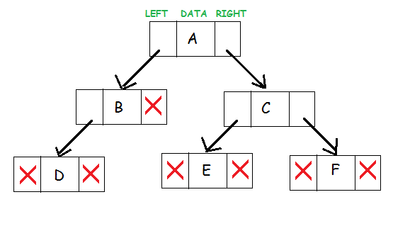

import Tabs from '@theme/Tabs';
import TabItem from '@theme/TabItem';

# Binary Tree 🌳

A Binary Tree is a non-linear data structure that has a mazimum of two children for each parent. The first node of the tree is called the root node and the other other nodes are associated with one parent node.



Each node in a binary tree has a left and right reference, and a data/value field. The data field contains the value to be stored in the node while the left and right fields contain a reference to the left and right child nodes respectively.


__credit https://www.upgrad.com/blog/5-types-of-binary-tree/__

## Terminologies
1. Node - The termination point of a tree. Single element structure of a tree.

2. Root - The first node of the tree.

3. Parent - Each node of the tree except the root that has at least one child 

4. Leaf Node - Nodes without children

5. Child - Sub-node of a parent node.

6. Internal node - Inner nodes with at least one child

7. Depth of tree - The number of edges from the tree's node to the root.

8. Height of tree - Number of edges from the node to the deepest leaf.

## Types of Binary Tree

Binary Trees can be of the following types:

1. Full Binary Tree − The parent nodes have either zero or two children.


__credit https://www.upgrad.com/blog/5-types-of-binary-tree/__

2. Complete Binary Tree − All the tree levels are filled completely with nodes except the lowest level of the tree. If he last node has one child, it should reside on the left.


__credit https://www.upgrad.com/blog/5-types-of-binary-tree/__

3. Perfect Binary Tree − All the parent nodes (internal nodes) have two children and every leaf node is at the same depth.


__credit https://www.upgrad.com/blog/5-types-of-binary-tree/__

4. Balanced Binary Tree - The left and right subtrees of every node differ in height by no more than 1.


__credit https://www.upgrad.com/blog/5-types-of-binary-tree/__

5. Degenerate Binary Tree - Every internal node has only a single child. 


__credit https://www.upgrad.com/blog/5-types-of-binary-tree/__


## Basic operations

When we want to operate on data in a Binary Tree we can perfomr the following operations:

1. Insertion − Adding a node between other nodes or added after a leaf node.
2. Deletion − Delete a node from the tree.
3. Trecersal − Pre-order, in-order and post-order traversal visit each noe in a tree by recursively visiting each node on the left and right subtrees.
4. Search − Searches for node holding a a given pi


## Advantages of Binary Trees

- An ideal way to store data in a hierachy
- Reflects structural relationships that exist in given data set.
- Faster to access elements than linked lists.
- Searching takes O(logn) time instead of O(n).
- Elements can be retrieved in sorted order.

## Disadvantages of Binary Trees

- The memory is wasted as pointers require extra memory for storage.
- Sequential storage may waste space.
- It takes O(logn) time to modify the list (balanced trees take longer - this is for the baseline) and to retrieve elements with a known location. 
- There is no efficient traversal

## Applications of Binary Trees

- Binary Search Tree - Used in many search applications that constantly show and hide data, such as data. For example, map and set objects in many libraries.

- Binary Space Partition - Used in almost any 3D video game to determine which objects need to be rendered.

- Binary Tries - Used in almost every high-bandwidth router to store router tables.

- Syntax Tree - Constructed by compilers and (implicit) calculators to parse expressions.

- Hash Trees - Used in P2P programs and special image signatures that require a hash to be validated, but the entire file is not available.

- Heaps - Used to implement efficient priority queues and also used in heap sort.

- Treap - Randomized data structure for wireless networks and - memory allocation.

- T-Tree - Although most databases use a form of B-tree to store data on the drive, databases that store all (most) data often use T-trees.

- Huffman Coding Tree (Chip Uni) - Used in compression algorithms, eg. For example, in .jpeg and .mp3.GGM Trees file formats - used in cryptographic applications to generate a tree with pseudo-random numbers.


## Sample Code

<Tabs
    defaultValue="cpp"
    values={[
        { label: 'Cpp', value: 'cpp', },
        { label: 'Python', value: 'py', },
        { label: 'Matlab', value: 'matlab', },
    ]
}>
<TabItem value="cpp">

```cpp
#include <stdlib.h>
#include <iostream>

using namespace std;

struct node
{
	int data;
	struct node *left;
	struct node *right;
};

// New node creation
struct node *newNode(int data)
{
	struct node *node = (struct node *)malloc(sizeof(struct node));

	node->data = data;

	node->left = NULL;
	node->right = NULL;
	return (node);
}

void addNode(struct node** root, int data)
{
	if (*root == NULL)
	{
		*root = newNode(data);
	}
	else
	{
		if ((*root)->data > data)
		{
			if ((*root)->left != NULL)
				addNode(&(*root)->left, data);
			else
				(*root)->left = newNode(data);
		}
		else
		{
			if ((*root)->right != NULL)
				addNode(&(*root)->right, data);
			else
				(*root)->right =  newNode(data);
		}
	}
}

void _printBinaryTree(struct node *node)
{
	if (node != NULL)
	{
		_printBinaryTree(node->left);
		cout << node->data << " is a value held in a node" << endl;
		_printBinaryTree(node->right);
	}
}

void printBinaryTree(struct node *root)
{
	if (root != NULL)
		_printBinaryTree(root);
	else
		cout << "The Binary Tree is empty" << endl;
}

// Traverse Preorder
void traversePreOrder(struct node *node) {
	if (node != NULL)
	{
		cout << " " << node->data;
		traversePreOrder(node->left);
		traversePreOrder(node->right);
	}
}

// Traverse Inorder
void traverseInOrder(struct node *node) {
	if (node != NULL)
	{
		traverseInOrder(node->left);
		cout << " " << node->data;
		traverseInOrder(node->right);
	}
}

// Traverse Postorder
void traversePostOrder(struct node *node) {
	if (node != NULL) {
		traversePostOrder(node->left);
		traversePostOrder(node->right);
		cout << " " << node->data;
	}
}


int main()
{
	struct node* root = NULL;

	addNode(&root, 5);
	addNode(&root, 2);
	addNode(&root, 8);
	addNode(&root, 4);
	addNode(&root, 1);
	addNode(&root, 7);
	addNode(&root, 12);
	addNode(&root, 19);
	addNode(&root, 33);
	addNode(&root, 6);

	cout << "------- Start of Binary Tree -------\n" << endl;
	printBinaryTree(root);
	cout << "\n------- End of Binary Tree -------\n" << endl;

	cout << "\n------- Preorder traversal ---------" << endl;
	traversePreOrder(root);
	cout << "\n\n------- Inorder traversal ----------" << endl;
	traverseInOrder(root);
	cout << "\n\n------- Postorder traversal -------- " << endl;
	traversePostOrder(root);
	cout << "" << endl;

	return (0);
}


```

</TabItem>
<TabItem value="py">

```py
class Node:
    """ Class Node defines the structure of a single node of a binary tree

    Attributes:
        __data: Int value held by the node
        __left: Pointer to the left child of a parent/root
        __right: Pointer to the right child of parent/root

    """
    def __init__(self, data=None, left=None, right=None):
        """This method initializes a single node.

        Args:
            left (Node): This is a pointer to the left child of a parent/root

            data (Any): This defines the data that the node holds

            right (Node): This is a pointer to the right child of a parent/root

        """

        if type(data) is not int:
            raise TypeError("Data must be an integer value")

        elif (not isinstance(left, Node) and left is not None):
            raise TypeError("left must be an instance of Node")

        elif (not isinstance(right, Node) and right is not None):
            raise TypeError("right  must be an instance of Node")

        else:
            self.__left = left
            self.__data = data
            self.__right = right

    @property
    def left(self):
        """This method returns the left child of parent/root."""
        return (self.__left)

    @left.setter
    def left(self, left=None):
        """This method sets left child of parent/root.

        Args:
            left (Node): This is a pointer to the left child
            of a parent/root

        Raises:
            TypeError: When arguement is not of type Node

        """
        if (not isinstance(left, Node) and left is not None):
            raise TypeError("left must be an instance of Node")

        self.__left = left

    @property
    def data(self):
        """This method returns the data held by the node"""
        return (self.__data)

    @data.setter
    def data(self, data=None):
        """This method sets the data of the node.

        Args:
            data (int): This holds the data of the node.

        Raises:
            TypeError: When argument is not of type int

        """
        if type(data) is not int:
            raise TypeError("Data must be an integer value")

        self.__data = data

    @property
    def right(self):
        """This method returns the right child of parent/root."""
        return (self.__right)

    @right.setter
    def right(self, right=None):
        """This method sets right child of parent/root.

        Args:
            right_pointer (Node): This is a pointer to the right child
            of a parent/root

        Raises:
            TypeError: When arguement is not of type Node
        """

        if (not isinstance(right, Node) and right is not None):
            raise TypeError("right must be an instance of Node")

        self.__right = right


class BinaryTree:
    """ Class BinaryTree provides methods for creating, manipulating
    and traversing a binary tree.

    This class has no public class attributes

    """
    def __init__(self):
        """ This method initializes a single node """
        self.root = None

    def add(self, data):
        """This method creates the root of the binary tree if the root is None.
        Otherwise, it calls the _add() method
        and supplies it with the required arguement

        Args:
            data (Int): An integer value

        """
        if(self.root == None):
            self.root = Node(data)
        else:
            self._add(data, self.root)

    def _add(self, data, node):
        """ This method adds a node to the the binary tree.
        Args:
            data (Int): An integer value
            node (Node): A node in the tree
        """
        if(data < node.data):
            if(node.left != None):
                self._add(data, node.left)
            else:
                node.left = Node(data)
        else:
            if(node.right != None):
                self._add(data, node.right)
            else:
                node.right =  Node(data)

    def delete_binary_tree(self):
        """ This method deletes a binary tree """
        self.root = None

    def is_empty(self):
        """ This method checks whether the binary tree is empty"""
        return (self.root == None)

    def print_tree(self):
        """ This method prints calls the _print_tree() method
        if the root of the tree is not None
        """
        if(self.root != None):
            self._print_tree(self.root)
        else:
            print("The binary tree is empty")

    def _print_tree(self, node):
        """ This method recursively prints the values of the nodes in the tree

        Args:
            node (Node): A node in the tree

        """
        if (node != None):
            self._print_tree(node.left)
            print("{:d} is a value held in a node".format(node.data))
            self._print_tree(node.right)

    def find(self, data):
        """ This calls the _find() method if the tree is not empty

        Args:
            data (Int): Integer value

        """
        if type(data) is not int:
            raise TypeError("Data must be an integer value")

        if(self.root != None):
            self._find(data, self.root)
        else:
            print("Found None")

    def _find(self, data, node):
        """ This method recursively searches the tree for the arguement supplied

        Args:
            data (Int): Integer value
            node (Node): A node in the tree

        """
        if (data == node.data):
            print("Found {:d} in {}".format(node.data, node))
        elif (data < node.data and node.left != None):
            self._find(data, node.left)
        elif (data > node.data and node.right != None):
            self._find(data, node.right)


def main():
    binary_tree = BinaryTree()
    binary_tree.add(4)
    binary_tree.add(5)
    binary_tree.add(3)
    binary_tree.add(7)
    binary_tree.add(13)
    binary_tree.add(10)
    binary_tree.add(2)
    binary_tree.add(9)

    binary_tree.print_tree()

    binary_tree.find(10)

if __name__ == '__main__':
    main()


```
</TabItem>
<TabItem value="matlab">

```matlab

```

</TabItem>
</Tabs>

### Compilation

<Tabs
    defaultValue="cpp"
    values={[
        { label: 'Cpp', value: 'cpp', },
        { label: 'Python', value: 'py', },
        { label: 'Matlab', value: 'matlab', },
    ]
}>
<TabItem value="cpp">


</TabItem>
<TabItem value="py">


</TabItem>
<TabItem value="matlab">

</TabItem>
</Tabs>

## What's next?

- Check out the leet code [challenge 1](https://leetcode.com/problems/print-binary-tree/).
- Check out the leet code [challenge 2](https://leetcode.com/problems/design-browser-history/).
- Check out this python [tutorial](https://www.geeksforgeeks.org/binarytree-module-in-python/)
- Check out this cpp [tutorial](https://www.geeksforgeeks.org/binary-tree-set-1-introduction/)
- Check out this matlab [tutorial](https://uk.mathworks.com/help/matlab/matlab_oop/example-implementing-linked-lists.html)
- Find inspirations from [Wikipedia](https://en.wikipedia.org/wiki/Binary_tree)
- Get involved in the [JKUAT SES Community](https://github.com/JKUATSES/dataStructuresAlgorithms/)

Anything **unclear** or **buggy** in this tutorial? [Please report it!](https://github.com/JKUATSES/dataStructuresAlgorithms/issues)
